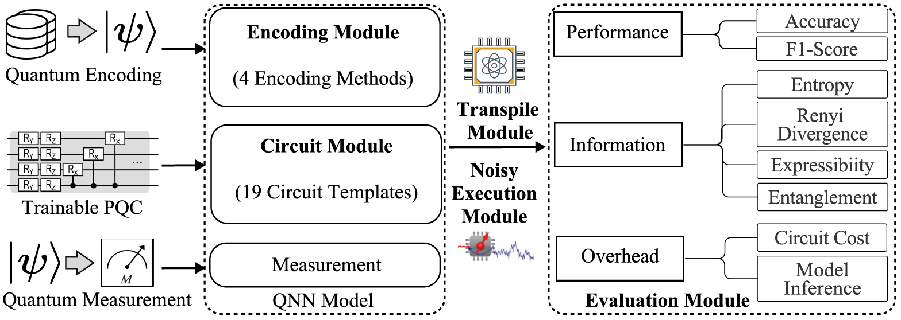

### ESQNN

## Introduction
ESQNN is a benchmark integrating different encoding methods and Parameterized Quantum Circuits(PQC) architectures to evaluate the performance of QNN models with a series of evaluation metrics, including model performance, quantum state distribution, and model overhead. ESQNN is integrated with 5 modules, including Quantum Encoding Module (QEM), Trainable Parameters Quantum Circuits Module (TPQCM), Transpile Module (TM), Noise-Injection Execution Module (NIEM), Evaluation Module (EM).



This component library can configure numerous circuits based on various circuit templates. We systematically evaluated 19 specific circuit templates in our study.

## Requirements

General library:
```bash
pip install scipy
pip install numpy
pip install pandas
pip install matplotlib
pip install sklearn
pip install torch
```

Quantum library:
```bash
pip install torchquantum 
pip install qiskit
pip install qiskit
pip install qiskit-aer
pip install qiskit-ibm-provider
pip install qiskit-ibm-runtime
pip install qiskit-ibmq-provider
pip install qiskit-terra 
pip install qutip
```

## Code configurations
We used [Torchquantum](https://github.com/mit-han-lab/torchquantum) to build our base runtime library, and the real machine experiments called [Qiskit](https://docs.quantum.ibm.com/api/qiskit/0.24) to run it; see their documentation for more details on how to use it!

## Folders
| Folder      | Description |
| ----------- | ----------- |
| code      | benchmark code |
| datasets   | Quantum circuits, this paper use ./enc_b1_cls_b2/ folder |
| overview   | Figures |

## Code Folders
| Folder      | Description |
| ----------- | ----------- |
| baselines      | All metrics evaluation files |
| configs   | Train and eval configurations |
| models   | Construct QNN models |
| qiskit_core  | Some Qiskit process file |
| utils | Tools for data processing |
| train.py   | Train QNN models|
| eval.py   | Eval QNN models |


## Running

To perform this test code, enter the ./code/ folder, run with
```bash
python train.py
python eval.py
```

### References
- [IBMQ Quantum](https://quantum-computing.ibm.com/), IBM - 2022
- [TorchQuantum](https://github.com/mit-han-lab/torchquantum), TorchQuantum - GitHub
- [QuantumNAT: Quantum noise-aware training with noise injection, quantization and normalization](https://arxiv.org/abs/2110.11331), Hanrui Wang and others - DAC 2022, ACM
- [Expressibility and entangling capability of parameterized quantum circuits for hybrid quantum-classical algorithms](https://arxiv.org/abs/1905.10876), Sukin Sim and others - AQT 2019
- [Concentration of data encoding in parameterized quantum circuits](https://arxiv.org/abs/2206.08273), Guangxi Li and others - Advances in Neural Information Processing Systems 2022
- [Quasi-entropies for finite quantum systems](https://www.sciencedirect.com/science/article/pii/0034487786900674), Dénes Petz - Reports on Mathematical Physics, Elsevier, 1986, Vol. 23, No. 1, pp. 57-65
- [Generalization in quantum machine learning: A quantum information standpoint](https://arxiv.org/abs/2102.08991), Leonardo Banchi and others - PRX Quantum, APS, 2021
- [Quantum embeddings for machine learning](https://arxiv.org/abs/2001.03622), Seth Lloyd, Maria Schuld, Aroosa Ijaz, Josh Izaac, Nathan Killoran - arXiv preprint arXiv:2001.03622, 2020
- [Quantum neural network classifiers: A tutorial](https://arxiv.org/abs/2206.02806), Weikang Li, Zhi-de Lu, Dong-Ling Deng - SciPost Physics Lecture Notes, 2022, pp. 061